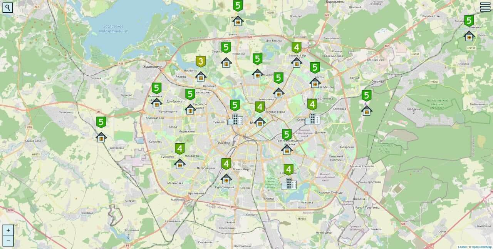

# Measureland

### An open source and not profit oriented social project. Completely free for everyone. Find the best place to live based on community reviews. Leave your ratings and comments to the well-known places. Let's share our experiences and help each other :)

Minsk, Belarus. Ratings in the image are purely random.

More info is in our [blog](https://measureland.org/blog):
- [about us](https://measureland.org/blog/about-us)
- [support](https://measureland.org/blog/support)
- [tutorial](https://measureland.org/blog/tutorial)
- [terms of use](https://measureland.org/blog/terms-of-use)
- [privacy policy](https://measureland.org/blog/privacy-policy)

## Contributing

Useful features, cool technologies ("hi Svelte!"), new ideas - the project is unique and doesn't have alternatives (at the moment of writing), we want to solve some of problems we all face every day - let's do it together, jump in! More then 10 people have shown their interest already.

We can think of 4 main ways of contributions:
- **Code itself.** SvelteKit, MongoDB, ExpressJS, algorithms, map optimizations, a lot of data - truly vaporous area to improve your skills or achieve new ones!
- **How-to-rent-in-your-city guide.** If you have experience of searching for a place in your town recently, it'd be extremely useful for everyone if you shared it. Check out the [existing guides](https://measureland.org/blog) and use the [template](blog/minsk-belarus)
- **Design and images.** We want to improve our visual thing as well, so your ideas/designs/images are welcome
- **Feedback.** We need it :)

If it's something that can interest you, contact via [Telegram](https://t.me/measurelandBot) or Email: RomanistHere@pm.me

## Getting started on programming

There is a guide on how to start back-end server inside back-end folder README.

We use #Svelte for front-end, links: [tutorial](https://svelte.dev/tutorial), [documentation](https://svelte.dev/docs). SvelteKit for building: [documentation](https://kit.svelte.dev/docs)
We suggest to name branches this way:

- **fix/something-bad** - for bug fixes
- **feat/something-good** - for new features
- **chore/update-something** - refactor

All branches go to/from master and applied by pull requests with reviews.

More info on how to start in our wiki: https://github.com/RomanistHere/Measureland/wiki/How-to-run-the-project

## Contact, feedback, suggestions

You can leave it here, in the repository or send via email:
- support@measureland.org - for queries and questions
- RomanistHere@pm.me - for business ideas, partnership and so on

**[Donate us money](https://www.donationalerts.com/r/romanisthere)**
