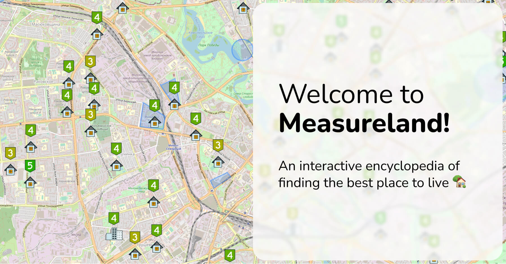

# Measureland - An interactive encyclopedia of finding the best place to live 🏡.

Check live [https://measureland.org/en/](https://measureland.org/en/)

We want to centralise house searching. We want to build a platform, where people would share their opinions about places they lived at. Where real-estate agencies would post (probably for money) trustworthy stats and information. Where opinions would be backed by facts. We want to build the only platform you need to pick better city, better district, better neighborhood to move to or stay at even if you know nothing about it. We want this platform to be transparent and free for everyone.

***The project is unique and doesn't have alternatives (at the moment of writing). We want to solve real problems people (us included) face every day. Especially bad these times. I could call them (times) "dark", a lot of people around abandoned their homes, fled from their countries. And it's very important to help. Showing the spirit is more important than ever. That's why we (mostly just myself, Roman Smunyov) do it. These times are for hope and for help.***

More info is in our [blog](https://measureland.org/en/blog/):
- [about us](https://measureland.org/en/blog/about-us/)
- [support](https://measureland.org/en/blog/support/)
- [tutorial](https://measureland.org/en/blog/tutorial/)
- [terms of use](https://measureland.org/en/blog/terms-of-use/)
- [privacy policy](https://measureland.org/en/blog/policy/)

## How can you achieve review's trustworthy? Everybody lies, you know.

That is a complex thing to resolve indeed. We can't say we already did, but here is how we're managing it right now:
- **[Wisdom of the crowd](https://en.wikipedia.org/wiki/Wisdom_of_the_crowd).** Where one opinion can lie, one hundred and one makes the average almost "true".
- **System of reports.** See something implausible? Let us know. We want to grow independent and trustworthy community to check things like that.
- **System of limitations.** There are a few layers of protection: vs bots, vs newbies leaving too many ratings, vs scams and so on. These "layers" are combinations of tech stuff like firewalls and manual moderation.
- **Watching unusual activity.** New rating got a lot of attention in a few hours? *Mark as suspicious*. Didn't get a lot of attention but is getting it every day from different just registered users? *Mark as suspicious*. New rating targeting the same area as another one from yesterday and another 3 days ago with the same good ratings and all from newbies? *Mark them all as suspicious*.
- **User reputation system a-ka Karma.** It's very simple for now (likes add, dislikes remove) and is not for display. But it may change in the future.
- **Facts.** There is a *Measurements-and-stats* tab on each rating, where you can check stats gathered from external services, like [waqi.info](https://waqi.info/) (World's air pollution) and so on. We plan to expand it. Unluckily most of them are not free, so if you have some influence on that, we would be grateful if you helped us :)
- **And the icing on the cake, Points of Interest.** These are exclamation marks on the map. We use them to point to something relevant to accommodation search that everyone needs to know about. For example some factory that pollutes air nearby. It's going to be hard for someone to scam-rate air quality as 5 for imaginary self-profit if there is factory nearby that pollutes air with 20 endorsements on it.

This list will grow, we have ideas already. For example, we plan to build a system that will compare new rating with already existing, and if it differs significantly from those around, it'll remove amount of points from user's reputation (existing or separate). We also want to grow control group of independent "experts", honest people and probably some agencies, that will help us find truth.

## Technologies we use

[We fond of Svelte](https://measureland.org/en/blog/why-svelte/). Front-end built with Svelte/SvelteKit and Tailwind.

Back-end part is Node, Express and MongoDB. Some changes are to be expected there soon.

## Contributing

Useful features, cool technologies, new ideas - jump in! More than 10 people have shown their interest already.

We can think of 4 main ways of contributions:
- **Code itself.** SvelteKit, Tailwind, MongoDB, ExpressJS, algorithms, map optimizations, a lot of data - truly vaporous area to improve your skills or achieve new ones!
- **How-to-rent-in-your-city guide.** If you have experience of searching for a place in your town recently, it'd be extremely useful for everyone if you shared it. Check out the [existing guides](https://measureland.org/blog) and use the [template](src/markdown/guides/en/minsk-belarus.md)
- **Design and images.** We want to improve our visual thing as well, so your ideas/designs/images are welcome
- **Feedback.** We need it :)

If it's something that can interest you, contact via [Telegram](https://t.me/measurelandBot) or email: RomanistHere@pm.me

## Getting started on programming

There is a guide on how to start back-end server inside back-end folder README.

We use Svelte for front-end, links: [tutorial](https://svelte.dev/tutorial), [documentation](https://svelte.dev/docs). SvelteKit for building: [documentation](https://kit.svelte.dev/docs)

Some other tools we use (links to documentation): [leaflet](https://leafletjs.com/), [tailwind](https://tailwindcss.com/docs), [noUiSlider](https://refreshless.com/nouislider/), [swiper](https://swiperjs.com/svelte), [svelte-i18n](https://github.com/kaisermann/svelte-i18n), [polybooljs](https://github.com/velipso/polybooljs)

We suggest naming branches this way:

- **fix/something-bad** - for bug fixes
- **feat/something-good** - for new features
- **chore/update-something** - refactor

All branches go to/from master and applied by pull requests with reviews.

More info on how to start in our wiki: [https://github.com/RomanistHere/Measureland/wiki/How-to-run-the-project](https://github.com/RomanistHere/Measureland/wiki/How-to-run-the-project)

## Contact, feedback, suggestions

You can leave it here, in the repository or send via email:
- support@measureland.org - for queries and questions
- RomanistHere@pm.me - for business ideas, partnership and so on

**[Support on Open Collective](https://opencollective.com/measureland)** - our expenses.
